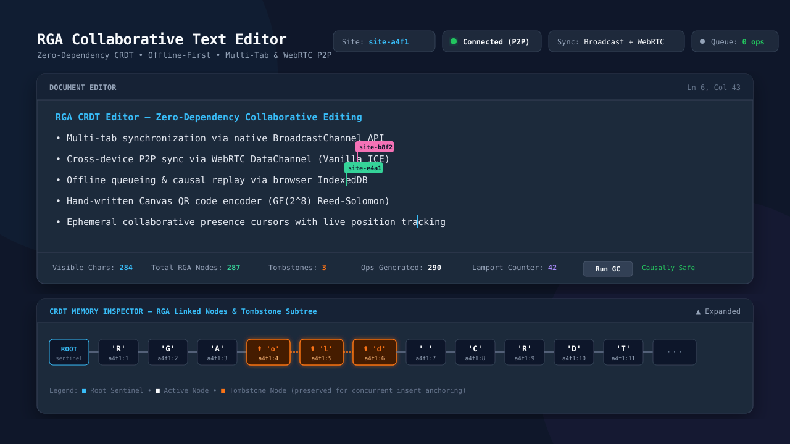
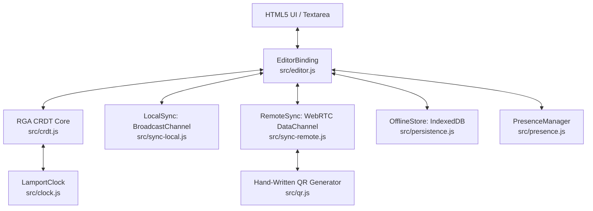

# Zero-Dependency Collaborative Text Editor (RGA CRDT)



A peer-to-peer, offline-first collaborative text editor built completely from scratch in pure vanilla JavaScript (ES6+). 

Implements a hand-rolled **Replicated Growable Array (RGA)** Conflict-free Replicated Data Type (CRDT), multi-tab synchronization via `BroadcastChannel`, cross-device peer-to-peer sync via **WebRTC DataChannels** (featuring a hand-crafted Canvas QR code encoder), **IndexedDB** offline queuing with causal deduplication, and collaborative **presence cursors**.

**Zero npm packages. Zero external runtime dependencies. Zero frameworks.** Every algorithm—from Galois Field arithmetic and Reed-Solomon error correction to Lamport timestamp tie-breaking and text diffing—is hand-implemented using only native browser APIs.

---

## Why This Project Exists
----------------------------
Most collaborative text editors rely on high-level libraries like Yjs, Automerge, or ShareDB. While production-ready, these black-box abstractions hide the fundamental distributed systems problems:
1. How do two replicas agree on the exact sequence of characters without a centralized server?
2. How do we prevent concurrent edits from clobbering each other across network partitions?
3. How do we guarantee mathematical convergence across arbitrary network latency and reordering?

This project was built to explore and defend these core distributed systems fundamentals from first principles:
- **P2P Decentralization**: No central server dictates the canonical document order.
- **Local-First / Offline-First**: Edits apply immediately to the local replica with zero latency; synchronization happens asynchronously.
- **Strong Eventual Consistency**: Replicas that have applied the same set of operations in any order are guaranteed to converge to the exact same text state.

---

## The RGA Algorithm Explained (Interview Primer)

### 1. The Core Data Structure
In a standard text editor, text is an indexed string or array: `['c', 'a', 't']`. If Site A inserts `'s'` at index 0 and Site B deletes index 2 concurrently, their index references clash, requiring complex operational transformation (OT) through a central server.

RGA replaces positional indices with **globally unique, immutable identifiers**:
```javascript
id = {
  siteId: 'site-a1b2',  // Unique replica identifier
  counter: 4            // Monotonically increasing Lamport clock counter
}
```

Instead of a flat array, RGA organizes text as a **doubly-linked list of nodes embedded with a sibling tree**:
```javascript
class Node {
  id;         // { siteId, counter }
  char;       // 'a', 'b', 'c', etc.
  afterId;    // Lamport ID of the node this character was inserted after
  deleted;    // Boolean tombstone flag
  prev, next; // Doubly-linked list pointers (for linear reading)
  children;   // Array of direct child nodes inserted after this node
}
```

A sentinel root node (`id = null`) marks the beginning of the document.

---

### 2. Resolving Concurrent Inserts (Deterministic Tie-Breaking)

Suppose two peers start with the document `"cat"`.
- Character `'c'` has ID `(A, 1)`
- Character `'a'` has ID `(A, 2)`
- Character `'t'` has ID `(A, 3)`

Both users place their cursors between `'a'` and `'t'` and type concurrently:
- **Alice (`site-A`)** types `'r'` (aiming for `"cart"`)
  - Operation: `Insert(char: 'r', afterId: (A, 2), id: (A, 4))`
- **Bob (`site-B`)** types `'p'` (aiming for `"capt"`)
  - Operation: `Insert(char: 'p', afterId: (A, 2), id: (B, 4))`

```
                    ┌──────────────┐
                    │  'a' (A, 2)  │
                    └──────┬───────┘
            Concurrent Inserts after (A, 2)
                   ┌───────┴───────┐
                   ▼               ▼
           ┌──────────────┐ ┌──────────────┐
           │  'r' (A, 4)  │ │  'p' (B, 4)  │
           │ (from Alice) │ │  (from Bob)  │
           └──────────────┘ └──────────────┘
```

Both operations declare `afterId = (A, 2)`. They are **concurrent siblings**. Which one appears first?

#### The Tie-Breaking Rule
RGA defines a **total order** over all node identifiers using `compareIds(a, b)`:
1. Compare Lamport `counter`: Higher counter wins.
2. If counters are equal, compare `siteId` lexicographically: `'site-B' > 'site-A'`, so `site-B` wins.

Here, both operations have `counter = 4`, but `'site-B' > 'site-A'`. Therefore:
$$\text{ID}(\text{'p'}) > \text{ID}(\text{'r'})$$

**RGA Sibling Placement Rule**:
> When multiple nodes share the same `afterId`, siblings with higher Lamport IDs are placed to the left (closer to the parent), before any lower-ID siblings and their subtrees.

#### Convergence Result
Both Alice and Bob evaluate the tie-breaking rule identically:
1. `'p'` has a higher ID than `'r'`.
2. `'p'` is spliced immediately after `'a'`.
3. `'r'` is placed after `'p'`.

Both replicas deterministically converge to:
$$\mathbf{"capt"}$$

No central coordinator was contacted. No lock was acquired.

---

### 3. Concurrent Delete & The Tombstone Invariant

What happens if Alice deletes character `'a'` while Bob concurrently inserts `'r'` after `'a'`?

```
Alice: Delete('a')  ────────┐
                            ├─► Merge ─► What should happen?
Bob:   Insert('r', after: 'a') ───┘
```

If Alice physically unlinked and freed `'a'`, Bob's insert would arrive with an unknown `afterId: (A, 2)`. The node would be orphaned, and Bob's edit would be lost or misplaced.

**The Solution: Tombstones**
- `delete(id)` never frees memory. It sets `node.deleted = true`.
- The node remains in the linked list and child tree so future or concurrent inserts can anchor to it.
- When generating the visible string (`toString()`), nodes with `deleted === true` are bypassed.
- **Result**: Alice's delete succeeds, Bob's `'r'` is preserved immediately after the deleted `'a'`, and the document converges to `"crt"`.

---

### 4. Causal Buffering (Out-of-Order Delivery Tolerance)
Networks can reorder packets. If an insert arrives referencing an `afterId` that hasn't arrived yet:
1. The operation is buffered in `pendingOps`.
2. As soon as the missing parent node arrives, `_flushPendingOps()` triggers and recursively splices all dependent children into place.
3. If a delete operation arrives before the insert it targets, the ID is buffered in `pendingDeletes` and marked deleted immediately upon arrival.

---

### 5. Sticky Cursor Anchoring
When remote operations arrive, the visible text changes. If an editor simply tracks cursor offset by index (e.g. index 5), incoming edits before index 5 will shift the user's cursor unexpectedly.

To maintain a sticky cursor:
1. Before applying remote edits, record the Lamport ID of the visible character directly preceding the cursor: `anchorId = idAt(selectionStart - 1)`.
2. Apply the remote operations.
3. Resolve the anchor back to its new visible position: `newIndex = indexOfId(anchorId) + 1`.
4. **Deleted Anchor Fallback**: If the character preceding the cursor was deleted remotely, `findPrecedingVisibleNode(anchorId)` walks backward along `node.prev` to snap the cursor to the nearest surviving ancestor.

---

## Architecture



### Module Responsibilities

| Module | File | Purpose |
|---|---|---|
| **CRDT Core** | `src/crdt.js` | Pure RGA data structure. Zero DOM, zero network, zero storage awareness. |
| **Lamport Clock** | `src/clock.js` | Monotonic logical clock and total ordering comparator (`compareIds`). |
| **Editor Binding** | `src/editor.js` | Keystroke diffing (`computeDiff`), synchronous state updates, and sticky cursor anchor tracking. |
| **Local Sync** | `src/sync-local.js` | Browser-native `BroadcastChannel` transport with late-join sync handshake. |
| **Remote Sync** | `src/sync-remote.js` | WebRTC `RTCPeerConnection` with Vanilla ICE bundling and ordered `RTCDataChannel`. |
| **QR Generator** | `src/qr.js` | Hand-written ISO/IEC 18004 QR encoder: $GF(2^8)$ arithmetic, Reed-Solomon EC, and Canvas rendering. |
| **Offline Store** | `src/persistence.js` | Browser `IndexedDB` storage with queue deduplication and reconnect replay. |
| **Presence** | `src/presence.js` | Throttled ephemeral cursor broadcasting and mirror-div overlay rendering. |

---

## How to Run & Verify

### Prerequisites
- Node.js (v18+ recommended for native `--test` runner). No npm packages required.

### 1. Run Automated Test Suite
```bash
npm test
```
Runs 64 automated unit tests across 22 test suites covering:
- RGA out-of-order op convergence & random permutation fuzzing
- Concurrent insert tie-breaking at start, middle, and end
- Concurrent delete + insert-after-deleted preservation
- Delete idempotence & causal out-of-order buffering
- Keystroke diffing algorithms (typing, backspace, forward delete, paste, replacement)
- Sticky cursor math and deleted anchor fallback
- IndexedDB offline queueing, deduplication, and 1:1 keystroke verification
- Galois Field $GF(2^8)$ multiplication and Reed-Solomon polynomial division
- QR matrix dimension formulas ($4V+17$) and pattern placement
- Tombstone garbage collection safety invariants
- Presence color hashing and broadcast throttling

---

### 2. Start the Local Server
```bash
node server.js
```
Open `http://localhost:3000` in your browser.

---

### 3. Manual Testing Scenarios

#### Scenario A: Multi-Tab Same-Device Sync
1. Open `http://localhost:3000` in Tab 1.
2. Click **"Open Collaborator Tab"** to launch Tab 2.
3. Type in either tab; observe real-time character synchronization and remote cursor markers.
4. Inspect the **CRDT Memory Inspector** at the bottom to watch the RGA linked list and Lamport clocks advance in real time.

#### Scenario B: Offline Mode & Replay
1. In Tab 1, click **"Simulate Offline"**.
2. Type `[offline edit]` into the editor.
3. Notice that Tab 2 does not receive the changes, and the **Offline Queue** counter shows the exact number of operations queued in IndexedDB.
4. Click **"Go Online (Replay Queue)"**.
5. Watch the queued operations replay, deduplicate against existing state, and merge cleanly into Tab 2.

#### Scenario C: Cross-Device WebRTC P2P Sync (No Server)
1. Open `http://localhost:3000` on Device A (or Browser A).
2. Open `http://localhost:3000` on Device B (or Browser B).
3. On Device A, click **"P2P Remote Sync"** → Click **"Generate Offer"**.
4. Copy the Offer SDP JSON (or scan the generated QR code if using small payloads) and paste it into Device B's **Guest** tab.
5. On Device B, click **"Generate Answer"**, copy the Answer JSON, and paste it back into Device A.
6. Click **"Complete Connection"**. The status dot turns green (**Connected P2P**).
7. Edits and cursor positions now sync directly over the WebRTC DataChannel.

---

## Known Limitations & Trade-Offs

In the spirit of honest engineering, here are the architectural trade-offs and real-world limitations:

1. **Tombstone Garbage Collection requires full cluster knowledge**:
   - `gcTombstones(knownSiteCounters)` can only safely prune a tombstone when *every* site's Lamport clock has advanced past that tombstone's counter.
   - In an open P2P network where peers can join or leave silently without a formal membership protocol (e.g. virtual synchrony or vector clocks), pruning tombstones risks data divergence if an offline peer later reconnects with an operation referencing a pruned node.
   - For safety, the implementation restricts GC to **leaf tombstones** (nodes with no child references), avoiding complex tree re-parenting.

2. **WebRTC Signaling & NAT Traversal**:
   - The implementation uses Google's public STUN servers for ICE candidate gathering. It does **not** include a TURN relay server.
   - While connections succeed seamlessly across local networks, VPNs, and most home routers, peers behind symmetric NATs or restrictive corporate firewalls cannot establish direct P2P connections without a TURN relay.

3. **QR Code Payload Limits**:
   - The hand-written QR encoder supports **Versions 1–5, Error Correction Level L**, capping single-block payload capacity at **106 bytes**.
   - Full WebRTC SDPs typically span 600–1,200 bytes. While compressed SDP fragments can fit into higher QR versions, multi-block interleaving was scoped out to maintain zero dependencies and algorithmic clarity. The UI gracefully falls back to 1-click clipboard copy/paste for large SDP payloads.

4. **Byzantine Fault Tolerance**:
   - The CRDT assumes honest peers (crash-fault tolerance). A malicious peer could forge Lamport timestamps or corrupt the op stream. Production distributed systems require cryptographic signing of operations.

5. **Presence Overlay Heuristic**:
   - Remote cursor coordinates are measured using a hidden DOM mirror div that matches the textarea's font, line-height, and padding. While accurate across standard zoom levels, subtle pixel drifts can occur with custom browser sub-pixel rendering settings.

---

## Test Coverage Summary

```text
▶ RGA CRDT Convergence Tests                    ✔ 9/9 passing
▶ Editor Diffing and Cursor Math Tests           ✔ 10/10 passing
▶ Tombstone Garbage Collection Tests            ✔ 6/6 passing
▶ OfflineStore Persistence and Replay Tests      ✔ 5/5 passing
▶ Presence Utility Tests                        ✔ 8/8 passing
▶ QR Code Generator Tests                       ✔ 23/23 passing
▶ LocalSync BroadcastChannel Transport Tests    ✔ 3/3 passing

Total: 64 passing across 22 suites (0 failures, 0 external dependencies)
```

---

## License
MIT
